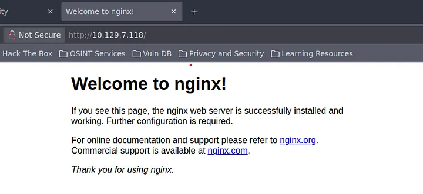
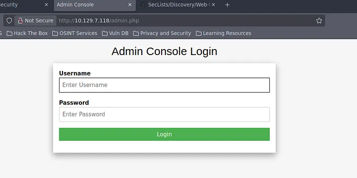
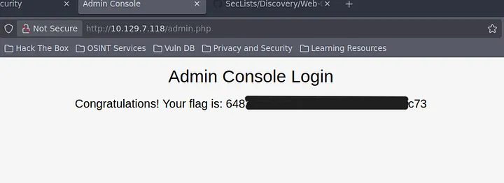

# Introduction

On continue notre ascension avec **Preignition**, la sixième machine du parcours Starting Point de Hack The Box (Tier 0). Cette fois-ci, on s'éloigne des services réseaux "bruts" pour s'attaquer au monde du **Web**. On va apprendre à découvrir des pages cachées et à tester la plus grande faiblesse des admins pressés : les **identifiants par défaut**.

:::tip
Attention : Il s'agit d'une machine VIP. Vous aurez besoin d'un abonnement HTB pour pouvoir la lancer.
:::

:::warning
Dans ce writeup, je ne publie pas directement le flag final, l'objectif est d'apprendre en pratiquant.
:::

## Vidéo Walkthrough

<iframe
  width="100%"
  style={{aspectRatio: '16/9'}}
  src="https://www.youtube.com/embed/g0zbzkjaCIY"
  title="Preignition Walkthrough"
  frameBorder="0"
  allow="accelerometer; autoplay; clipboard-write; encrypted-media; gyroscope; picture-in-picture"
  allowFullScreen
/>

---

## Reconnaissance

### Découverte d'hôte

```bash
┌─[user@parrot]─[~]
└──╼ $ping 10.129.7.118

64 bytes from 10.129.7.118: icmp_seq=3 ttl=63 time=13.4 ms
```

### Énumération des services

```bash
┌─[user@parrot]─[~]
└──╼ $nmap -sV 10.129.7.118

PORT   STATE SERVICE VERSION
80/tcp open  http    nginx 1.14.2
```

Un seul port ouvert : le **80**. Serveur web **nginx 1.14.2**. En navigant vers l'IP, on tombe sur la page par défaut "Welcome to nginx".



---

## Pré-Exploitation

### Énumération de répertoires avec Gobuster

Puisque la page d'accueil ne montre rien, on cherche des dossiers ou fichiers cachés avec **Gobuster**.

```bash
┌─[user@parrot]─[~]
└──╼ $sudo gobuster dir -w /usr/share/wordlists/common.txt -u 10.129.7.118

/admin.php  (Status: 200) [Size: 999]
```

Gobuster trouve **/admin.php** (Status 200 = accessible) !

---

## Exploitation

### Accès initial

On se rend sur `http://10.129.7.118/admin.php` — un formulaire de connexion.



Comme le serveur semble être une installation fraîche, on tente les identifiants par défaut :
- **Username** : `admin`
- **Password** : `admin`

Ça fonctionne ! On est connecté.

### Récupération du flag

Une fois connecté sur l'interface d'administration, le flag est affiché directement.



La machine est **pwned** !

---

## Post-Exploitation

Deux vulnérabilités illustrées ici :
- **Pages d'administration exposées** : ne jamais laisser accessible sans protection supplémentaire
- **Identifiants par défaut** : toujours les changer dès l'installation d'un service
