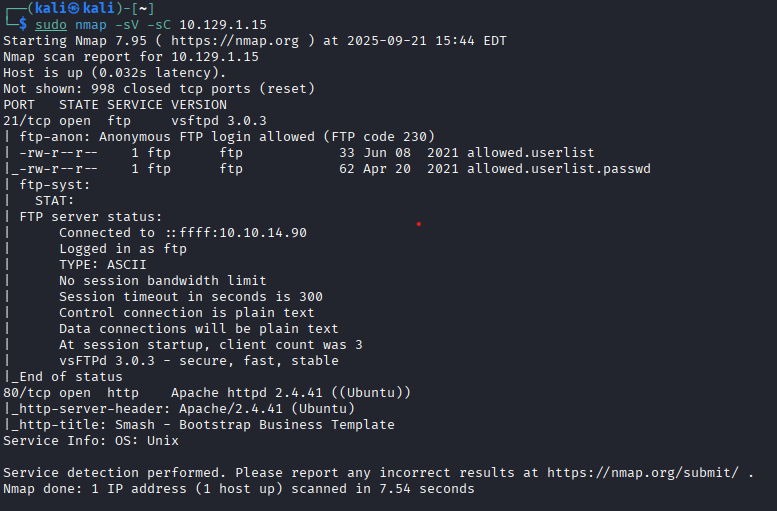
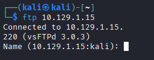
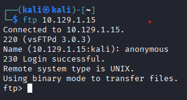
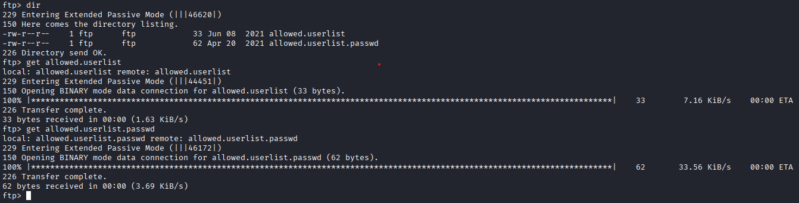
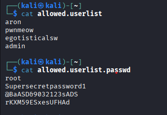
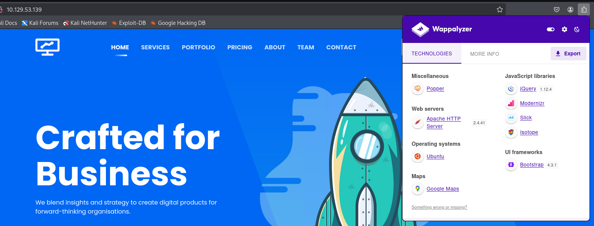
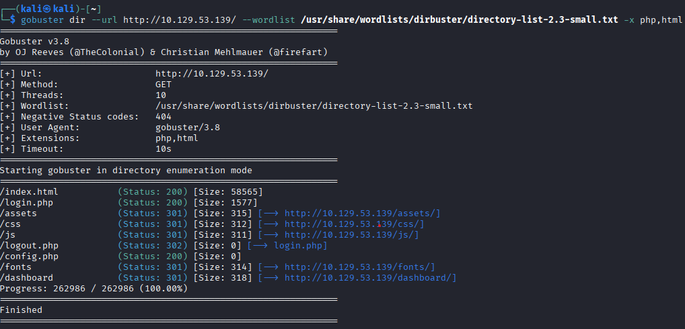
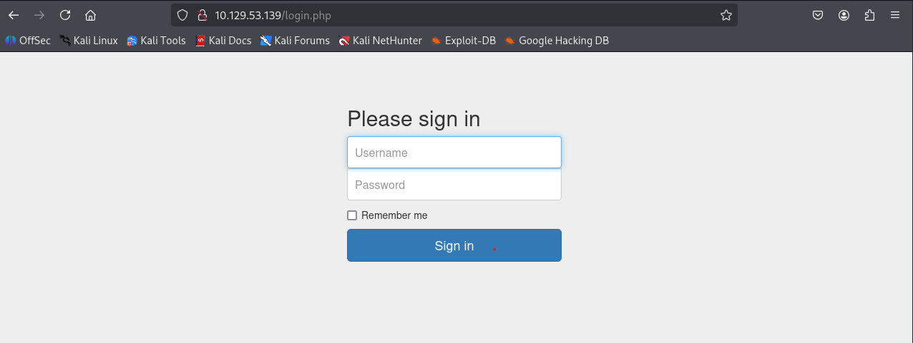
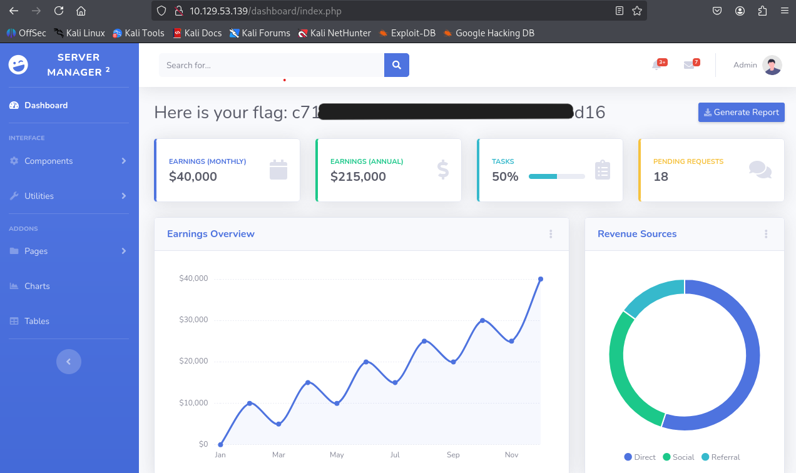

# Introduction

Pour cette machine **Crocodile**, nous avons identifié une mauvaise configuration du service **FTP**. Celle-ci nous a permis de récupérer des identifiants pour nous connecter à une **page web** d'administration. Un scénario classique où un service "oublié" donne les clés pour un autre.

:::warning
Dans ce writeup, je ne publie pas directement le flag final, l'objectif est d'apprendre en pratiquant.
:::

:::caution
N'attaquez que des machines sur lesquelles vous avez l'autorisation. Respectez les règles de la plateforme.
:::

[▶ RavenBreach sur YouTube](https://www.youtube.com/@Raven_Breach/videos)

---

## Reconnaissance

### Scan NMAP

```bash
sudo nmap -sV -sC 10.129.1.15
```



Le scan révèle deux ports ouverts :
- **21 (FTP)** : vsftpd 3.0.3 — avec `ftp-anon: Anonymous FTP login allowed`
- **80 (HTTP)** : Apache httpd 2.4.41

Les scripts nmap signalent immédiatement : deux fichiers intéressants sont accessibles : `allowed.userlist` et `allowed.userlist.passwd`.

### Récupération des fichiers FTP

```bash
ftp 10.129.1.15
```



Login : `anonymous`, mot de passe vide.



```
230 Login successful.
```



On récupère les deux fichiers avec `get`.

### Analyse des fichiers



On y trouve une liste d'utilisateurs (admin, aron, pwnmeow, etc.) et une liste de mots de passe. C'est une mine d'or !

### Analyse de la page web

En naviguant vers l'IP sur le port 80 :



L'extension Wappalyzer indique une stack PHP. On cherche une page de connexion.

### Fuzzing des répertoires avec Gobuster

```bash
gobuster dir --url http://10.129.1.15/ --wordlist /usr/share/wordlists/dirbuster/directory-list-2.3-small.txt -x php,html
```



Gobuster trouve `login.php`.

---

## Exploitation

En navigant vers `http://10.129.1.15/login.php` :



On essaie le compte `admin` avec le premier mot de passe de la liste.



La connexion fonctionne ! Le flag est affiché sur le tableau de bord.

La machine est **pwned** !
