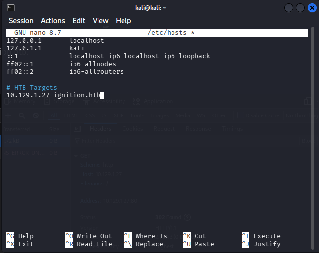
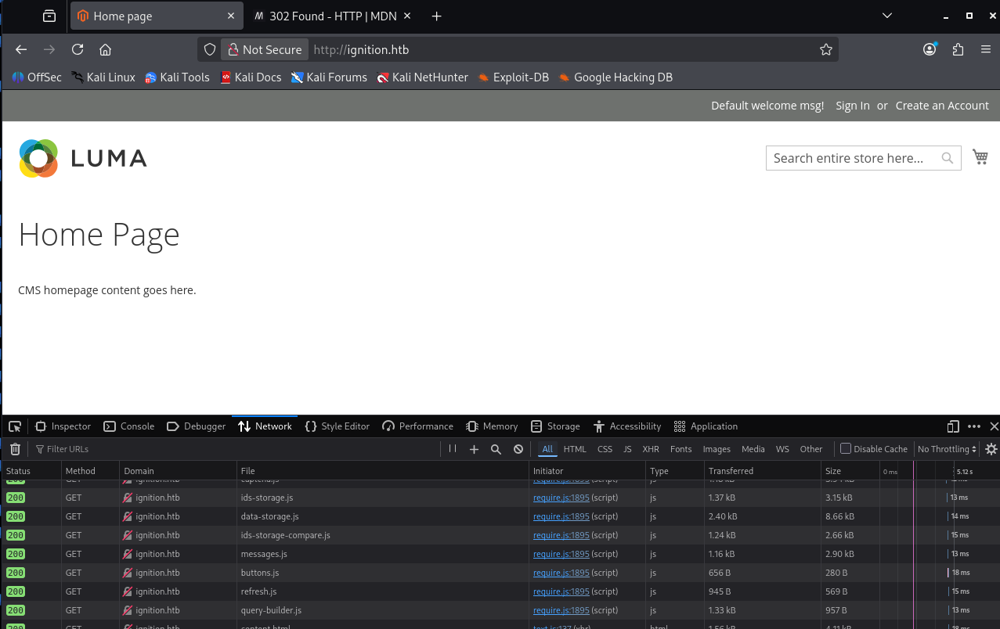
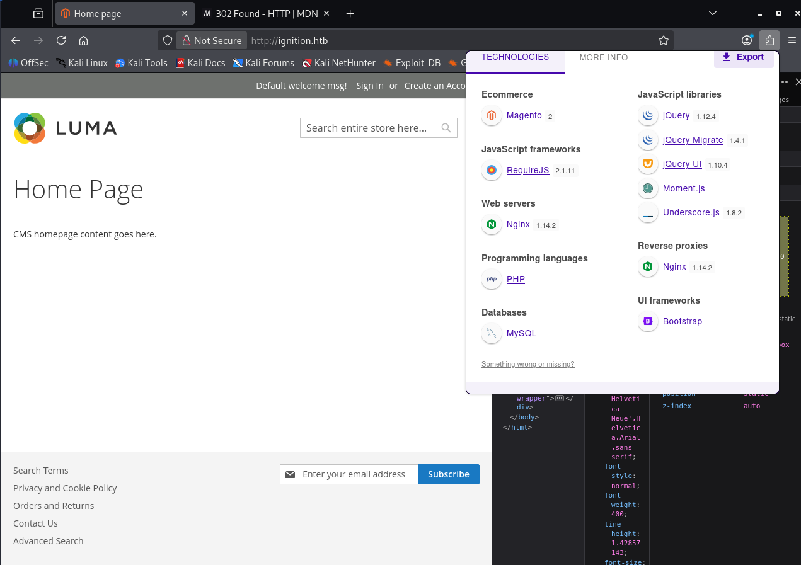
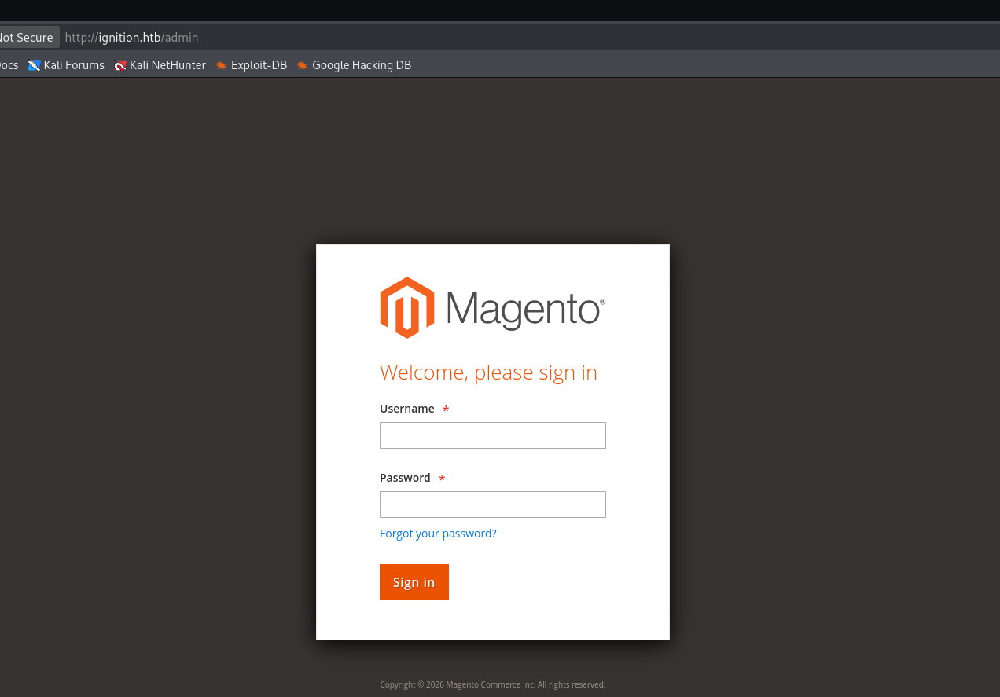
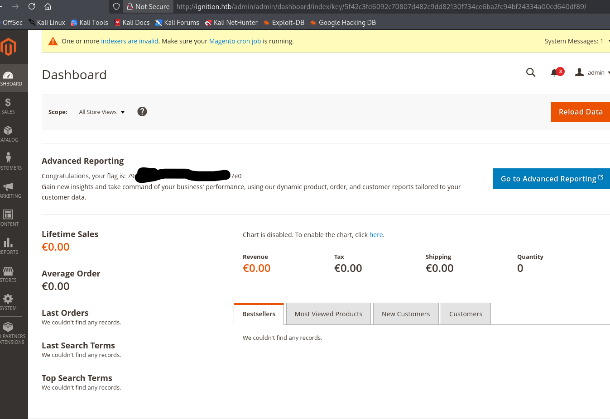

# Introduction

Bienvenue sur **Ignition**, une machine du **Tier 1** de **Starting Point** qui nous rappelle qu'un panneau d'administration exposé avec des identifiants faibles peut suffire à compromettre un système entier. Pas d'exploitation complexe — de la reconnaissance méthodique, **Gobuster**, et la bonne vieille recherche de **mots de passe communs**.

:::tip
Attention : Il s'agit d'une machine VIP. Vous aurez besoin d'un abonnement HTB pour pouvoir la lancer.
:::

:::warning
Dans ce writeup, je ne publie pas directement le flag final, l'objectif est d'apprendre en pratiquant.
:::

:::caution
N'attaquez que des machines sur lesquelles vous avez l'autorisation. Respectez les règles de la plateforme.
:::

[▶ RavenBreach sur YouTube](https://www.youtube.com/@Raven_Breach/videos)

---

## Reconnaissance

### Découverte d'hôte

```bash
┌──(kali㉿kali)-[~]
└─$ ping 10.129.1.27

64 bytes from 10.129.1.27: icmp_seq=1 ttl=63 time=11.5 ms
```

Machine **Linux**.

### Énumération des services

```bash
┌──(kali㉿kali)-[~]
└─$ nmap -p80 -sV -sC 10.129.1.27

PORT   STATE SERVICE VERSION
80/tcp open  http    nginx 1.14.2
|_http-title: Did not follow redirect to http://ignition.htb/
```

Le scan révèle une **redirection** vers `http://ignition.htb/` — Name-Based Virtual Hosting.

### Configuration DNS locale

```bash
sudo nano /etc/hosts
# Ajouter : 10.129.1.27 ignition.htb
```



En accédant à `http://ignition.htb` :



L'analyse avec **Wappalyzer** révèle un CMS **Magento** (PHP, JavaScript, MySQL).



---

## Pré-Exploitation

### Enumération des répertoires avec Gobuster

La page d'accueil ne présente rien d'exploitable. On tente des injections XSS/SQL mais les entrées sont validées. On passe à l'énumération.

```bash
┌──(kali㉿kali)-[~]
└─$ sudo gobuster dir -w /usr/share/wordlists/common.txt -u http://ignition.htb

/admin  (Status: 200) [Size: 7092]
```

La route `/admin` est accessible (code 200) !

### Découverte du panneau d'administration

En naviguant vers `http://ignition.htb/admin` :



Formulaire de connexion Magento Admin.

---

## Exploitation

### Recherche d'identifiants valides

Il n'existe pas d'identifiants par défaut universels pour Magento. La [documentation Adobe pour Magento](https://experienceleague.adobe.com/en/docs/commerce-admin/systems/security/security-admin) précise que la politique de mots de passe impose un minimum de **7 caractères** avec un mélange de **lettres et chiffres**.

La machine date de **2021**. En croisant cette contrainte avec les listes de mots de passe les plus courants de 2021, on tente `admin` / `qwerty123`.

:::tip
Sur une vraie mission, on utiliserait Hydra pour automatiser le bruteforce. Ici, la liste est suffisamment courte pour être testée manuellement et éviter tout blocage côté serveur.
:::

La connexion réussit !



Le flag est affiché directement sur le dashboard.

La machine est **pwned** !

---

## Conclusion

Chaîne d'attaque :
1. **Reconnaissance** → nginx avec redirection vers `ignition.htb`, ajout `/etc/hosts`
2. **Fingerprinting** → détection de Magento via Wappalyzer
3. **Enumération** → route `/admin` trouvée avec Gobuster
4. **Exploitation** → connexion `admin` / `qwerty123`, mot de passe commun respectant la politique Magento 2021
