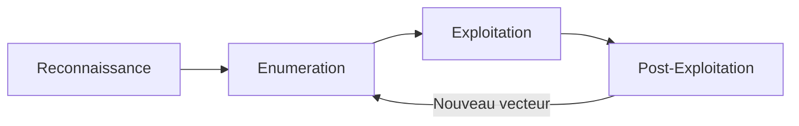

# Methodologie

## C'est quoi ?

La **Methodologie** est un **guide de decision** pour le pentest. C'est ton copilote qui te dit quoi faire a chaque etape, selon ce que tu vois devant toi.

Contrairement au [Cheatsheet](/docs/cheatsheet) qui est un dictionnaire de commandes, la methodologie est un **arbre de decision** : *"j'ai trouve le port 445, je fais quoi maintenant ?"* → tu ouvres la page correspondante et tu suis la checklist.

## Quelle difference avec le Cheatsheet ?

| | [Cheatsheet](/docs/cheatsheet) | Methodologie |
|---|---|---|
| **Question** | *"Comment j'utilise cet outil ?"* | *"Je vois X, je fais quoi ?"* |
| **Organisation** | Par outil / technique | Par situation / etape du pentest |
| **Format** | Commandes + flags + exemples | Checklists + arbres de decision |
| **Exemple** | "Voici la syntaxe de nmap -sC -sV" | "J'ai un port 80 ouvert, je fais quoi ?" |

**En resume** : la methodologie te dit **quoi faire**, le cheatsheet te dit **comment le faire**. Les deux se completent.

## Comment l'utiliser

### Pendant un pentest

1. **Commence par la [Reconnaissance](./01-reconnaissance/)** : suis la checklist pour decouvrir les services
2. **Identifie les ports ouverts** → va sur la page du port dans [Enumeration](./02-enumeration/) (ex: port 80 → HTTP, port 445 → SMB)
3. **Suis les checklists** : chaque page te guide etape par etape avec des cases a cocher
4. **Quand tu trouves un vecteur** → va dans [Exploitation](./03-exploitation/) pour le scenario correspondant
5. **Une fois dedans** → suis la checklist [Post-Exploitation](./04-post-exploitation/) selon l'OS
6. **Consulte les [Scenarios](./05-scenarios/)** pour voir des chaines d'attaque completes deja rencontrees

### Lire les checklists

Chaque page contient des checklists du type :

```markdown
- [ ] Tester la connexion anonyme
- [ ] Lister les fichiers
- [ ] Chercher des credentials
```

Les liens vers le **Cheatsheet** te donnent la commande exacte quand tu en as besoin.

## Comment l'alimenter

A chaque nouvelle box craquee :

1. **Nouveau port/service rencontre ?** → Creer une page dans `02-enumeration/` avec la checklist de ce qu'il faut tester
2. **Nouveau scenario d'exploitation ?** → L'ajouter dans la page appropriee de `03-exploitation/`
3. **Nouvelle chaine d'attaque complete ?** → Creer une page dans `05-scenarios/`
4. **Nouveau reflexe post-exploit ?** → L'ajouter dans la checklist Linux ou Windows de `04-post-exploitation/`

:::tip
Chaque scenario est tagge avec la **box d'origine** pour retrouver le contexte complet dans les [Writeups](/writeups).
:::

## Phases



| Phase | Description |
|-------|-------------|
| **Reconnaissance** | Ping, scan de ports, identifier l'OS et les services |
| **Enumeration** | Explorer chaque service en detail selon le port |
| **Exploitation** | Obtenir un acces initial via la vulnerabilite trouvee |
| **Post-Exploitation** | Explorer le systeme, extraire les donnees, pivoter |
| **Scenarios** | Chaines d'attaque completes de bout en bout |
